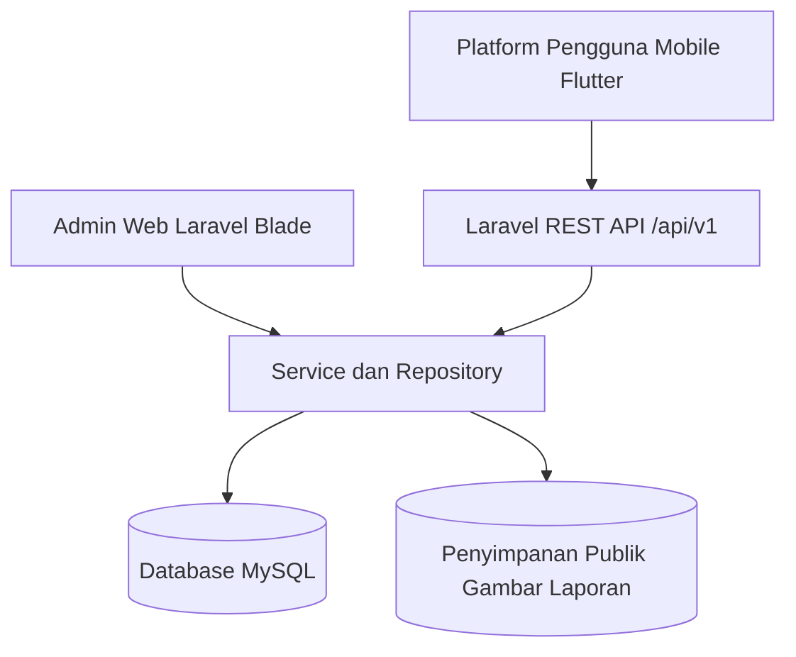
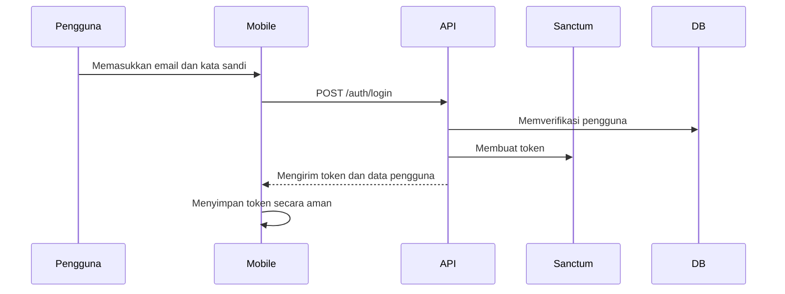
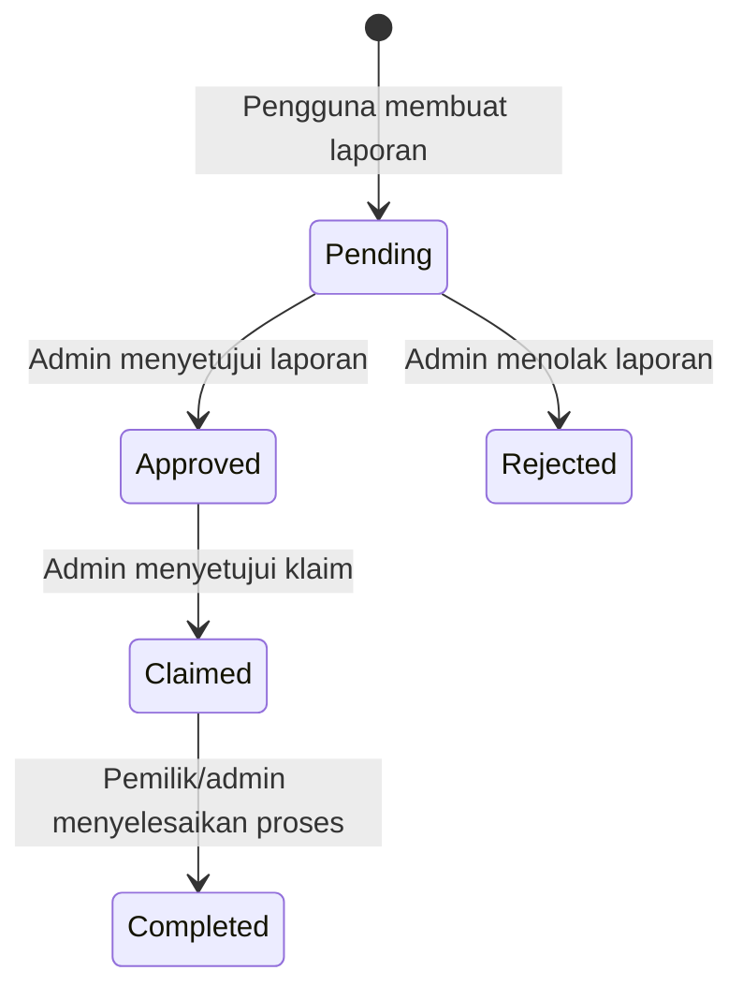
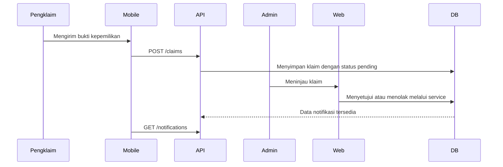

# Aset Visual

Dokumen ini menyiapkan diagram dan target screenshot yang siap dipakai untuk presentasi.

## Diagram Arsitektur Sistem



## Diagram Autentikasi



## Diagram Siklus Laporan



## Diagram Alur Klaim



## Struktur API

```text
/api/v1
  /auth
    POST /register
    POST /login
    GET  /me
    POST /logout
  /categories
    GET /categories
    POST /categories
    PUT /categories/{category}
    DELETE /categories/{category}
  /reports
    GET /reports
    POST /reports
    GET /reports/{report}
    PUT/PATCH /reports/{report}
    DELETE /reports/{report}
  /claims
    GET /claims
    POST /claims
    GET /claims/{claim}
  /notifications
    GET /notifications
    PATCH /notifications/{notification}/read
  /admin
    PATCH /admin/reports/{report}/approve
    PATCH /admin/reports/{report}/reject
    PATCH /admin/claims/{claim}/approve
    PATCH /admin/claims/{claim}/reject
```

## Checklist Screenshot

Screenshot web:

- Masuk admin.
- Ringkasan dashboard.
- Daftar manajemen laporan.
- Detail laporan dengan upload gambar.
- Detail klaim.
- Daftar notifikasi.
- Bukti PWA, seperti manifest atau prompt install.
- Halaman fallback offline.

Screenshot mobile:

- Halaman login.
- Feed laporan.
- Detail laporan.
- Form pembuatan laporan.
- Pratinjau kamera.
- Pratinjau GPS.
- Pengajuan klaim.
- Daftar dan detail notifikasi.

Screenshot dokumentasi:

- Output daftar route.
- Output test.
- Output build produksi.
- Slide diagram arsitektur.

## Panduan Pratinjau UI

- Gunakan data demo dari seeder agar teks konsisten.
- Jaga zoom browser di 100 persen.
- Gunakan kondisi database yang bersih.
- Jangan menampilkan secret atau nilai `.env` asli.
- Potong screenshot hanya pada area UI yang relevan.
- Gunakan satu ukuran perangkat yang konsisten untuk screenshot mobile.
